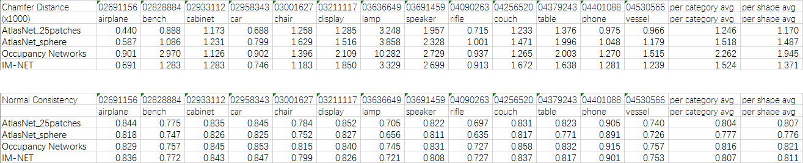

# implicit-decoder
The improved tensorflow code for paper "Learning Implicit Fields for Generative Shape Modeling", [Zhiqin Chen](https://www.sfu.ca/~zhiqinc/),  [Hao (Richard) Zhang](https://www.cs.sfu.ca/~haoz/).

### [project page](https://www.sfu.ca/~zhiqinc/imgan/Readme.html) |   [paper](https://arxiv.org/abs/1812.02822) |   [original implementation](https://github.com/czq142857/implicit-decoder) 


## Improvements
Encoder:

- In IM-AE (autoencoder), changed batch normalization to instance normalization.

Decoder (=generator):

- Changed the first layer from 2048-1024 to 1024-1024-1024.
- Changed latent code size from 128 to 256.
- Removed all skip connections.
- Changed the last activation function from sigmoid to clip ( max(min(h, 1), 0) ).

Training:

- Trained one model on the 13 ShapeNet categories as most Single-View Reconstruction networks do.
- For each category, sort the object names and use the first 80% as training set, the rest as testing set, same as [AtlasNet](https://github.com/ThibaultGROUEIX/AtlasNet).
- Reduced the number of sampled points by half in the training set. Points were sampled on 256<sup>3</sup> voxels.
- Removed data augmentation (image crops), same as [Occupancy Networks](https://github.com/autonomousvision/occupancy_networks).
- Added coarse-to-fine sampling for inference to speed up testing.


## Citation
If you find our work useful in your research, please consider citing:

	@article{chen2018implicit_decoder,
	  title={Learning Implicit Fields for Generative Shape Modeling},
	  author={Chen, Zhiqin and Zhang, Hao},
	  journal={Proceedings of IEEE Conference on Computer Vision and Pattern Recognition (CVPR)},
	  year={2019}
	}

## Dependencies
Requirements:
- Python 3.5 with numpy, scipy and h5py
- [Tensorflow](https://www.tensorflow.org/get_started/os_setup)
- [PyMCubes](https://github.com/pmneila/PyMCubes) (for matching cubes)
- [OpenCV-Python](https://opencv-python-tutroals.readthedocs.io/en/latest/) (for reading and writing images)

Our code has been tested with Python 3.5, TensorFlow 1.8.0, CUDA 9.1 and cuDNN 7.0 on Ubuntu 16.04 and Windows 10.


## Datasets and Pre-trained weights
The original voxel models are from [HSP](https://github.com/chaene/hsp).

The rendered views are from [3D-R2N2](https://github.com/chrischoy/3D-R2N2).

Since our network takes point-value pairs, the voxel models require further sampling.

For data preparation, please see directory [point_sampling](https://github.com/czq142857/IM-NET/tree/master/point_sampling).

We provide the ready-to-use datasets in hdf5 format, together with our pre-trained weights.

- [IMAE&IMSVR](https://drive.google.com/open?id=1N-TBEgb-Rx9vkDoTJanHwkHBe3w_yqgo)

Backup links:

- [IMAE&IMSVR (pwd: ayta)](https://pan.baidu.com/s/1gRylOMEj26U0lZ8CgbQ8Lg)

We also provide pointcloud files with normal for the shapes in ShapeNet. The points are sampled from only the surface of the shapes. We use floodfilled 256<sup>3</sup> voxel files in [HSP](https://github.com/chaene/hsp) to determine whether a point is inside a shape or on its surface.

- [pointcloud_surface](https://drive.google.com/open?id=16yiTtOrf6m4q9h3ZfhsG07JcAhLvZ0yk)

Backup links:

- [pointcloud_surface (pwd: lkux)](https://pan.baidu.com/s/140GVQa1DWdRUd-z0Rg4z1Q)

The quantitative evaluation results on the pointclouds mentioned above, comparing to [AtlasNet](https://github.com/ThibaultGROUEIX/AtlasNet) and [Occupancy Networks](https://github.com/autonomousvision/occupancy_networks), are as follows.




## Usage


To train an autoencoder, go to IMGAN and use the following commands for progressive training. You may want to copy the commands in a .bat or .sh file.
```
python main.py --ae --train --epoch 100 --real_size 16 --batch_size_input 4096
python main.py --ae --train --epoch 200 --real_size 32 --batch_size_input 4096
python main.py --ae --train --epoch 400 --real_size 64 --batch_size_input 16384
```
The above commands will train the AE model 100 epochs in 16<sup>3</sup> resolution (each shape has 4096 sampled points), then 100 epochs in 32<sup>3</sup> resolution, and finally 200 epochs in 64<sup>3</sup> resolution.
Training on the 13 categories takes about 4 days on one GeForce RTX 2080 Ti GPU.


To train a latent-gan, after training the autoencoder, use the following command to extract the latent codes:
```
python main.py --ae
```
Then train the latent-gan and get some samples:
```
python main.py --train --epoch 10000
python main.py
```
You can change some lines in *main.py* to adjust the number of samples and the sampling resolution.

To train the network for single-view reconstruction, after training the autoencoder, copy the weights and latent codes to the corresponding folders in IMSVR. Go to IMSVR and use the following commands to train IM-SVR and get some samples:
```
python main.py --train --epoch 2000
python main.py
```

## License
This project is licensed under the terms of the MIT license (see LICENSE for details).


